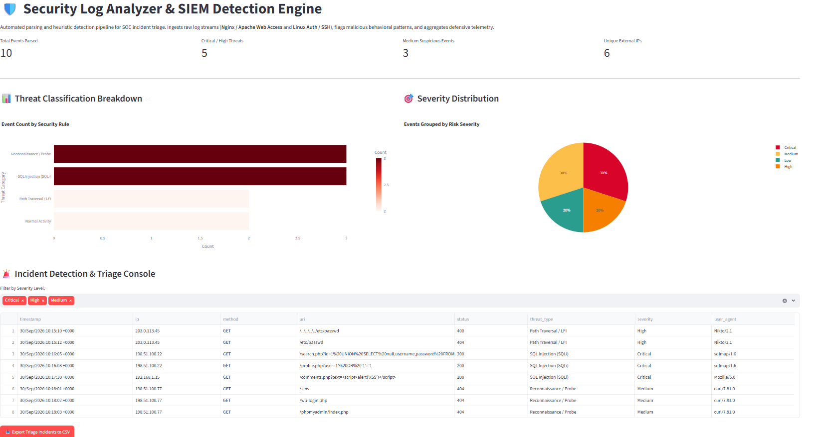
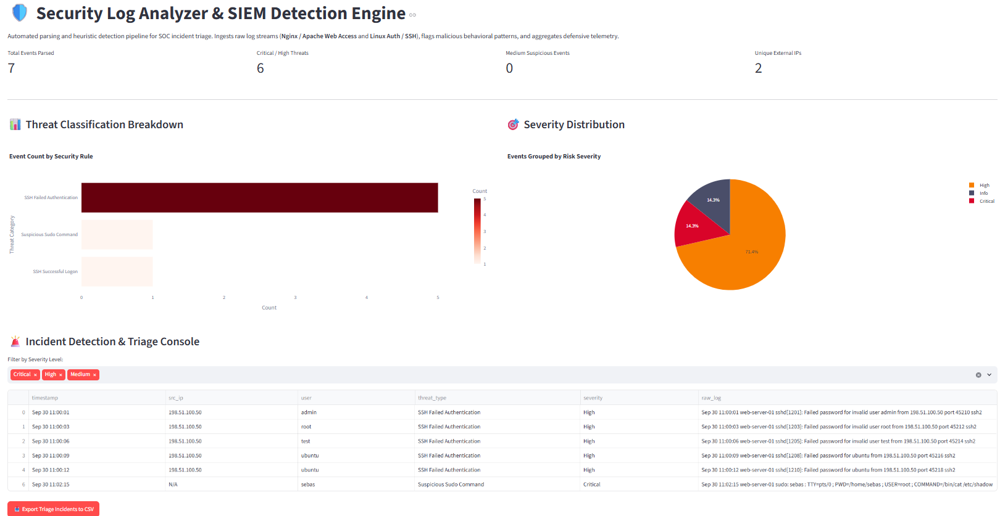

    # Security Log Analyzer & SIEM Detection Engine

A lightweight, automated log analysis and heuristic detection engine designed for SOC analysts and incident response workflows. Ingests raw telemetry from **Web Application Servers (Nginx / Apache)** and **Linux Authentication Subsystems (`auth.log` / Syslog)** to flag malicious behavioral patterns, classify attack vectors, and aggregate actionable defensive metrics in real time.

[](https://www.python.org/)
[](https://streamlit.io/)
[](https://plotly.com/)
[](https://opensource.org/licenses/MIT)

> 🚀 **Live Demo:** Access the interactive cloud app at [Deploy Link Pending]

---

## 🛡️ Core Capabilities & Detection Rules

- **Multi-Format Ingestion Engine:** Dynamically parses and normalizes unstructured log lines using high-throughput regular expressions:
  - **Web Access Logs (NCSA Combined/Common format):** Extracts client IP, HTTP request method, resource URI, status code, response payload size, and user agent strings.
  - **Linux System Authentication Logs (`auth.log`):** Ingests SSH daemon handshakes, authentication lifecycle events, and `sudo` privilege execution traces.
- **Heuristic Threat Detection & Classification:**
  - **SQL Injection (SQLi):** Flags SQL operand syntax, union-based extraction attempts, and comment truncations (`UNION SELECT`, `' OR 1=1--`).
  - **Path Traversal & Local File Inclusion (LFI):** Identifies directory climbing tokens and sensitive file targets (`../../etc/passwd`, `win.ini`).
  - **Cross-Site Scripting (XSS):** Flags payload vectors and script injection strings (`<script>`, `alert()`).
  - **Reconnaissance & Scanner Probing:** Detects automated fingerprinting targeting configuration and administrative entry points (`.env`, `wp-login.php`, `phpmyadmin`).
  - **SSH Brute-Force Activity:** Detects repeated unauthorized authentication failures across systemic and custom user accounts.
  - **Privilege Escalation Traces:** Highlights sensitive root-level commands executed via `sudo` targeting high-value system assets (e.g. `/etc/shadow`).
- **Interactive SOC Telemetry Dashboard:** Visualizes categorical risk breakdowns, severity distributions, and provides a multi-criteria incident triage table with one-click CSV forensic export.

---

## 📸 Telemetry & Triage Artifacts

### 1. Web Application Access Log Analysis (Nginx / Apache)


### 2. Linux Authentication & SSH Triage Console


---

## ⚙️ Local Setup & Execution

To test or develop the analyzer locally, run the following commands:

```bash
# 1. Clone repository
git clone [https://github.com/IanYosho/09_security-log-analyzer.git](https://github.com/IanYosho/09_security-log-analyzer.git)
cd 09_security-log-analyzer

# 2. Configure virtual environment
py -m venv venv
.\venv\Scripts\activate

# 3. Install dependencies
pip install -r requirements.txt

# 4. Launch the application
streamlit run app.py

🛠️ Tech Stack
Framework: Streamlit

Language: Python 3

Data Engineering: Pandas, Regular Expressions (re)

Visual Analytics: Plotly Express